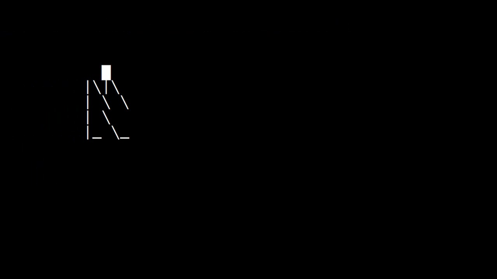
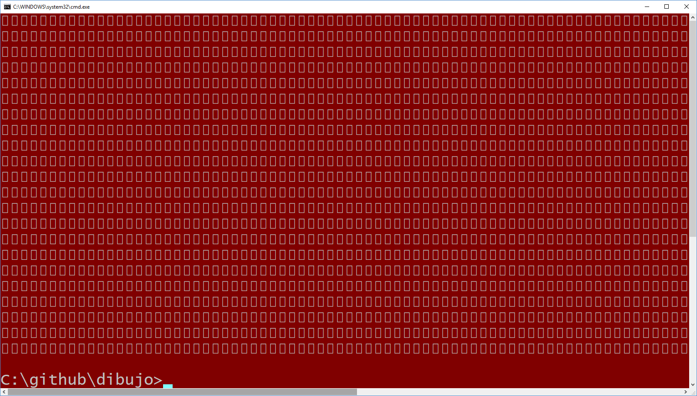
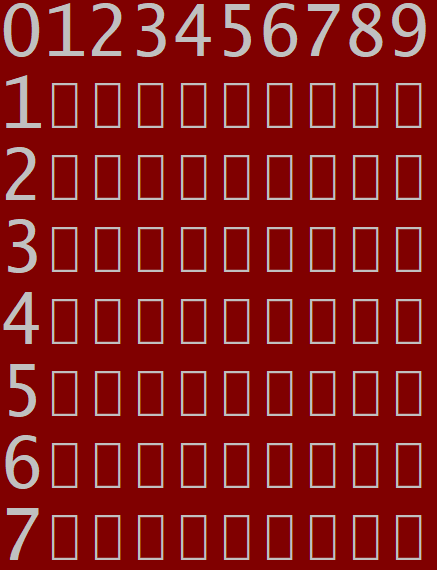
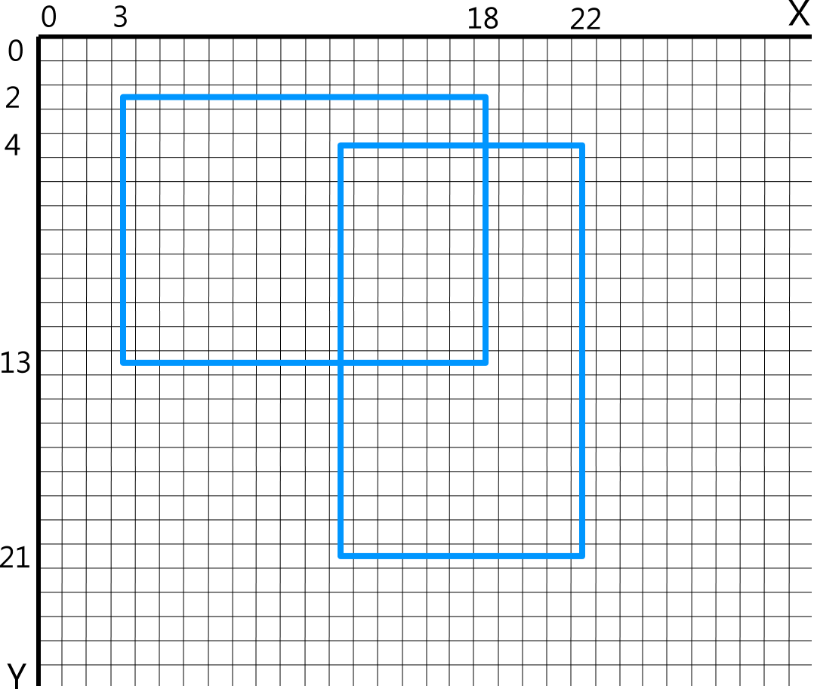

* * *
[3:1:3-4 Metodología]

# ¿Cómo llegar a crear una solución?

_**"Encontrar una solución consiste en construir un curso de acciones que transformen su situación actual en una donde su objetivo se ha logrado."**_

* * *
# ¿Cómo lo hacemos?

* Descomponer o desconstrucción de la solución en "partes" de su funcionalidad.
* Investigar posibilidades para cada pieza
* Hacer pruebas/prototipos, encontrar ejemplos, código, librerías etc.
* Por cada parte proponer como, con que tecnología y funcionalidad se puede implementarlo
* Diseñar como estructurar la solución y el código
* Implementar y Verificar
* Optimizar
* Entregar o poner en producción

* * *
# Dibujo proyecto


_**Descomponer la solución en "partes" de funcionalidad**_
## ¿Qué sabemos que vamos necesitar?


* * *
<video src="./Dibujomp4.mp4" width="90%" controls></video>
* * * 
# Análisis y desconstrucción 
## ¿Qué debería hacer?
* Pintar algo en la consola
* Cambiar color de texto y fondo
* Animar lo que pintamos => Animación
* Alguna partes se mueven, otras no

## Animación - ejemplo
* * *
</img>

* * * 

</img>
* * *
</img>

* Pintar algo en diferentes posiciones en la consola
* * * 

## Primer paso, lo básico
Empezamos pensar como vamos a ...
## _**Conseguir una pantalla estática, sin animación**_
Así, como pintar algo en la consola!

Eso **sabemos!** con... 

```
    console.log(...);
```
y con un `string` así
<code>
<pre>"

     Width: 80 Height: 26••••••••••
     •        •          •        •
     •        •          •        •
     •        •          •  ••••• •
     •        •          •  •   • •
     •    ••••••••••     •  •   • •
     •    •   •    •     •  •   • •
     •    •   •    •     •  •   • •
     •    •   •    •     •  ••••• •
     •    •   •    •     •        •
     ••••••••••    •     ••••••••••
          •        •
          •        •
          •        •
          •        •
          ••••••••••
"
</pre>
</code>


## ¿Qué queremos saber, o qué preguntas falta...?
## ¿Qué cosas hay?
## ¿Qué características tienen?
## ¿Qué tenemos que hacer con esto?

* * *


## Nuestra pantalla es una consola
¿Qué es una consola, qué es lo que tiene, qué comportamientos exhibe una consola?

## Una consola - cuadraditos en posiciones




Cada letra o carácter ordenados en filas y columnas 

Podemos nombrar o referir a cada posición con sus coordenadas **X** y **Y**



Cada posición entonces tiene:

* **Colores**
    * **De Texto**
    * **De Fondo**

* **Posicionamiento**
    * **X-axis**
    * **Y-axis**

* * * 
  
  
    

* **¿Qué pintar y dónde**
    * Carácter o símbolo
    * Su color, primer plano y fondo
    * En que lugar, **coordinadas X, Y**


## ¿Qué sabemos, y que NO sabemos?

### Sabemos como pintar texto en la consola
### No sabemos como cambiar el color del texto y fondo

# A buscar!

"**_how to change the colors in windows console from javascript_**"


https://stackoverflow.com/questions/9781218/how-to-change-node-jss-console-font-color


* * * 

## Sabemos como pintar texto en la consola, pero...
## ¿Cómo vamos pintar figuras, como rectángulos?

</img>

### **Rect1 : X = 3, Y = 2, Width = 15, Height =  11**
### **Rect2 : X = 12, Y = 4, Width = 19, Height =  17**

### Rectángulos
 * Altura, anchura, y posición **X** y **Y**
 * Son hecho de líneas
   * Líneas verticales
   * Líneas  horizontales
 
 _**Así primero necesitamos saber como pintar líneas horizontales, y verticales.**_

## **Rect1**: 
* Línea horizontal **top: X=3, Y=2, Length=15**
* Línea horizontal **bottom: X=3, Y=13, Length=15**
* Línea vertical **left: X=3, Y=2, Length=11**
* Línea vertical **right: X=18, Y=2, Length=11**

## **Rect2**: 
* Línea horizontal **top: X=12, Y=4, Length=10**
* Línea horizontal **bottom: X=12, Y=21, Length=10**
* Línea vertical **left: X=12, Y=4, Length=17**
* Línea vertical **right: X=22, Y=4, Length=17**

* * * 
